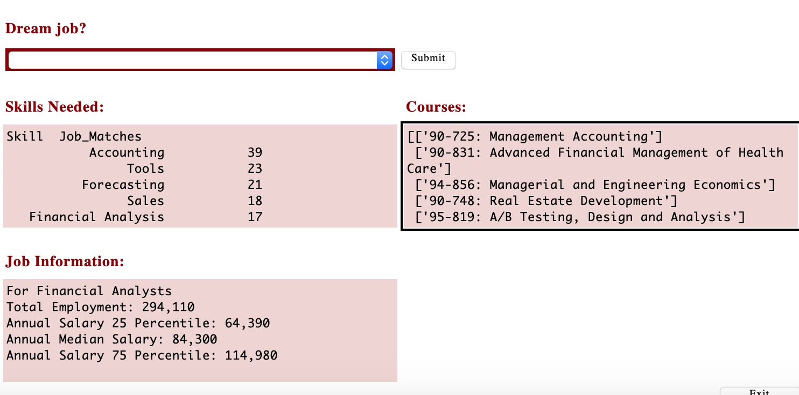

 

o   Submit as PDF

# Heinz College SkillScraper #
Do you have only 24 units left of electives and want to make sure your choices are aligned with employer demands?  The Heinz College SkillScraper is a one-stop shop for:
- Researching current employment trends and salary stats (**Bureau of Labor Statistics**)
- Learning about hot skills in today's marketplace (**Payscale.com**) 
- Aggregating job board listings (**Indeed.com**) 
- Choosing the most relevant courses to these demands, based on course descriptions and keywords (**Heinz Course Catalog**)

## Group 7 Members
- Jonathan Dyer, jondyer@cmu.edu
- Devraj Kori, dkori@andrew.cmu.edu
- Muriel Pokol, mpokol@andrew.cmu.edu
- Brian Rhindress, brhindre@andrew.cmu.edu
- Matthew Samach, msamach@andrew.cmu.edu

## Installation Instructions 

Modules used in the Heinz SkillScraper include: 
- SpaCy: https://spacy.io/usage/ 
- Pandas: https://anaconda.org/conda-forge/pandas
- Tkinter: https://docs.python.org/3/library/tkinter.html 
- BeautifulSoup: https://pypi.org/project/beautifulsoup4/
- urllib.request: 
- re (regex): 

o   Include installing any modules beyond what Anaconda provides

§  Instructions on installing non-Anaconda stuff manually, not auto-installed

o   Setting environment variables (but avoid this when possible)

o   Obtaining an API key

## Run Instructions 

After installing necessary modules, simply run the **Interface.py** program to launch the GUI.  The integrated master controller within the GUI will call other necessary modules.  Select a job from the drop-down menu and wait for the information! 

## Written-Modules included in this project: 

- :iphone: **Interface.py**: The Main Controller. This script creates the Heinz SkillScraper GUI, allows for user input, and draws on data from each of the other modules.

- :chart: **bls_data_frame.py**: This script generates a data frame, list of BLS-tracked jobs, and a list of salary and employment figures for a selected job.

- :dollar: **payscale_scraper.py**: This scrapes payscale.com for an up-to-date list of payscale.com skill listings. Not used in production version. 

- :briefcase: **Match_Indeed_to_skill.py**: Scrapes the top 5-pages from a selected indeed.com job search. Cross-compares and counts the number of job skill occurrences, based on payscale.com skill lists. 

- :school: **heinz_scraper.py**: This script scrapes the current Heinz course catalog, parses course descriptions, and compares keywords against key skill-words identified in the indeed.com scrape.  It then returns a list of all courses matching the job-skill pair. 

## Motivation
A short description of the motivation behind the creation and maintenance of the project. This should explain **why** the project exists.
 
## Screenshots and Video 

o   Link to video

## Features
What makes your project stand out?

## Installation
Provide step by step series of examples and explanations about how to get a development env running.

## API Reference
Depending on the size of the project, if it is small and simple enough the reference docs can be added to the README. For medium size to larger projects it is important to at least provide a link to where the API reference docs live.

## Credits
Give proper credits. This could be a link to any repo which inspired you to build this project, any blogposts or links to people who contrbuted in this project. 

## License
Carnegie Mellon University
Heinz College of Information Systems and Public Policy 
Heinz SkillScraper © 
